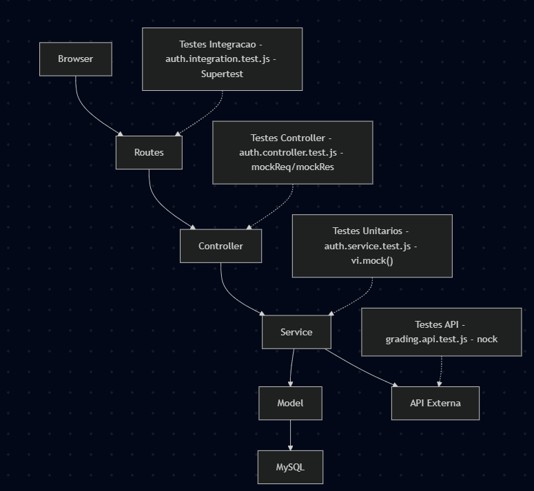
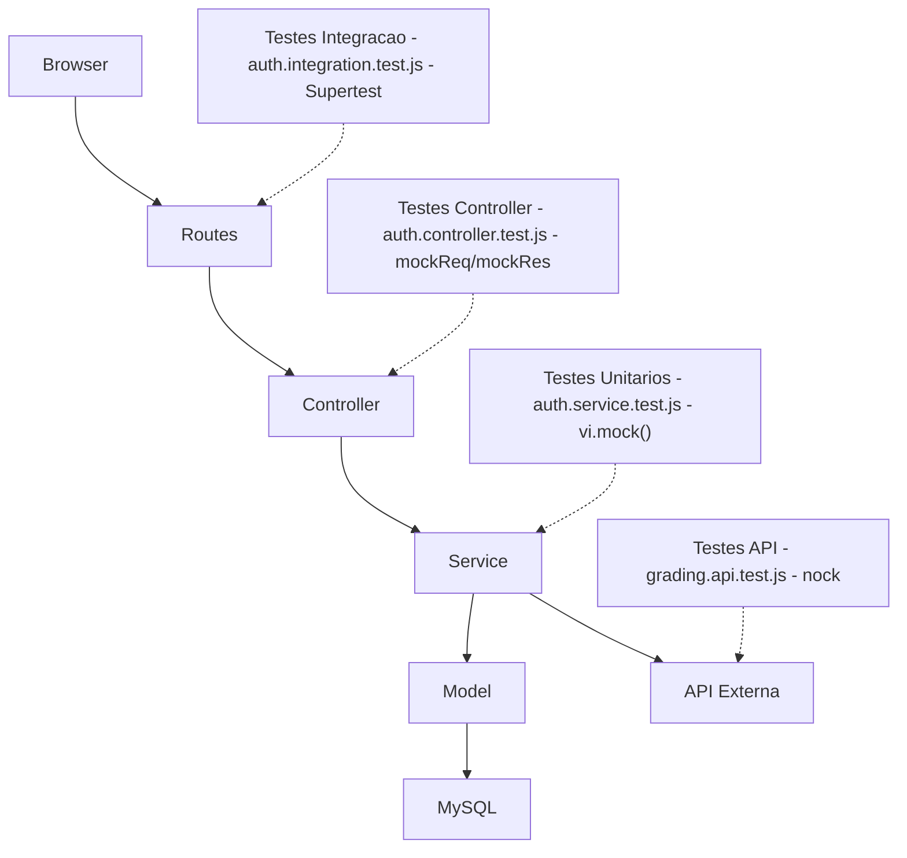

# Relatorio TDD — CodeLab

## 1. Funcionalidade Escolhida: Autenticacao de Usuarios

A funcionalidade que escolhi para aplicar o TDD foi o modulo de autenticacao, com duas operacoes principais: cadastro de usuario (register) e login.

Escolhi essa porque e o ponto de entrada de qualquer sistema — se o cadastro ou o login estiver errado, nada mais funciona. Fazia sentido comecar por aqui e garantir que estava solido antes de partir para o resto.

Regras de negocio do cadastro:
- Nome, email e senha sao obrigatorios
- Email deve ser unico. Se ja existir, lanca erro "Email ja cadastrado"
- Senha e armazenada com hash bcryptjs fator 10, nunca em texto puro
- Retorno contem apenas id, name e email

Regras de negocio do login:
- Busca o usuario pelo email. Se nao encontrar, lanca "Usuario nao encontrado"
- Compara a senha com bcrypt.compare
- Se invalida, lanca "Senha incorreta"
- Retorno contem apenas id, name e email, sem expor a senha

---

## 2. Diagrama de Arquitetura





---

## 3. Ciclo TDD Aplicado

O desenvolvimento seguiu o ciclo Red, Green e Refactor para cada regra de negocio. No comeco parecia estranho escrever um teste que vai falhar de proposito, mas depois que peguei o ritmo ficou natural.

**Red:** escrevo o teste antes do codigo. Ele falha porque a funcao ainda nao existe.

```js
it('deve lancar erro se email ja estiver cadastrado', async () => {
  UserModel.findOne.mockResolvedValue({ id: 1, email: 'joao@email.com' });
  await expect(
    register({ name: 'Joao', email: 'joao@email.com', password: '123456' })
  ).rejects.toThrow('Email ja cadastrado');
});
```

**Green:** implementei o minimo para o teste passar, sem nada a mais.

```js
export const register = async ({ name, email, password }) => {
  const existing = await UserModel.findOne({ where: { email } });
  if (existing) {
    throw new Error('Email ja cadastrado');
  }
  const hashed = await bcrypt.hash(password, 10);
  const user = await UserModel.create({ name, email, password: hashed });
  return { id: user.id, name: user.name, email: user.email };
};
```

**Refactor:** com o teste verde, melhorei a organizacao sem medo de quebrar nada. Se algo quebrasse, o teste avisava na hora.

---

## 4. Exemplos de Testes Unitarios

### Teste 1 — Cadastro com sucesso

```js
it('deve cadastrar um novo usuario', async () => {
  UserModel.findOne.mockResolvedValue(null);
  bcrypt.hash.mockResolvedValue('hashed123');
  UserModel.create.mockResolvedValue({ id: 1, name: 'Joao', email: 'joao@email.com' });

  const result = await register({ name: 'Joao', email: 'joao@email.com', password: '123456' });

  expect(result).toEqual({ id: 1, name: 'Joao', email: 'joao@email.com' });
});
```

Verifica que, quando o email nao existe e o hash e gerado, o register retorna os dados do usuario criado. O vi.mock() isola o banco completamente — nenhuma conexao real e aberta.

### Teste 2 — Email duplicado

```js
it('deve lancar erro se email ja estiver cadastrado', async () => {
  UserModel.findOne.mockResolvedValue({ id: 1, email: 'joao@email.com' });

  await expect(
    register({ name: 'Joao', email: 'joao@email.com', password: '123456' })
  ).rejects.toThrow('Email ja cadastrado');
});
```

Verifica a regra de unicidade do email. O mockResolvedValue simula que o banco ja tem esse email registrado, e o rejects.toThrow confirma que o erro certo e lancado com a mensagem exata.

### Teste 3 — Senha nao retornada no login

```js
it('o retorno do login deve ter id, name e email mas nao a senha', async () => {
  UserModel.findOne.mockResolvedValue({
    id: 1, name: 'Joao', email: 'joao@email.com', password: 'hashed123',
  });
  bcrypt.compare.mockResolvedValue(true);

  const result = await login({ email: 'joao@email.com', password: '123456' });

  expect(result).toHaveProperty('id');
  expect(result).toHaveProperty('name');
  expect(result).toHaveProperty('email');
  expect(result.password).toBe(undefined);
});
```

Esse foi um dos testes mais importantes pra mim. O model retorna o usuario com a senha, mas o service nao pode repassar isso. O toBe(undefined) garante que a senha nunca vaza pra quem chamou o login.

---

## 5. Refatoracoes

### Refatoracao 1 — Controller: de JSON para redirect

No inicio o controller retornava JSON direto, porque eu comecei pensando em API:

```js
export const registerHandler = async (req, res) => {
  try {
    const user = await register(req.body);
    req.session.user = user;
    res.status(201).json({ success: true, user });
  } catch (err) {
    res.status(400).json({ success: false, message: err.message });
  }
};
```

Quando decidi usar formularios HTML com EJS, precisei mudar pra redirect:

```js
export const registerHandler = async (req, res) => {
  try {
    const { name, email, password, confirmPassword } = req.body;
    if (password !== confirmPassword) {
      req.flash('error', 'As senhas nao coincidem');
      return res.redirect('/');
    }
    const user = await register({ name, email, password });
    req.session.user = user;
    res.redirect('/dashboard');
  } catch (err) {
    req.flash('error', err.message);
    res.redirect('/');
  }
};
```

Os testes do controller foram reescritos junto, passando a verificar redirects em vez de status codes JSON. Sem os testes eu teria medo de fazer essa mudanca. Com eles, sabia exatamente o que precisava atualizar.

### Refatoracao 2 — Service: validacao de email duplicado

No inicio deixava o banco lancar o erro de constraint de unicidade:

```js
export const register = async ({ name, email, password }) => {
  const hashed = await bcrypt.hash(password, 10);
  const user = await UserModel.create({ name, email, password: hashed });
  return { id: user.id, name: user.name, email: user.email };
};
```

O problema e que o erro vinha do banco com uma mensagem tecnica que o usuario nao entenderia. Escrevi o teste de email duplicado primeiro (fase Red), o que me forcou a adicionar a validacao explicita:

```js
export const register = async ({ name, email, password }) => {
  const existing = await UserModel.findOne({ where: { email } });
  if (existing) {
    throw new Error('Email ja cadastrado');
  }
  const hashed = await bcrypt.hash(password, 10);
  const user = await UserModel.create({ name, email, password: hashed });
  return { id: user.id, name: user.name, email: user.email };
};
```

A mensagem de erro ficou sob controle da aplicacao, nao do banco. Esse e exatamente o tipo de melhoria que o TDD forca — o teste exigiu uma experiencia melhor, e o codigo teve que se adaptar.

---

## 6. Cobertura de Codigo

Executar com: `npm run test:coverage`

| Metrica | Resultado |
|---------|-----------|
| Statements | 67,79% |
| Branches | 60,00% |
| Functions | 76,00% |
| Lines | 66,53% |
| Total de testes | 48 passando |

Toda vez que terminava um ciclo, rodava o npm run test:coverage so pra ver onde ainda tinha buraco. Em um momento o Branches estava em 60% e fui olhar o que nao estava coberto — descobri que o caminho onde a senha esta errada no login nunca tinha sido testado. Escrevi o teste, rodei de novo, o numero subiu. Fiz a mesma coisa quando vi que usuario nao encontrado tambem nao tinha cobertura. Para o auth.service.js fui repetindo isso ate bater 100%. No comeco eu achava que os testes estavam prontos quando passavam, mas o relatorio de cobertura me mostrou varias vezes que eu estava errado. Virou um habito: termina o teste, roda o coverage, ve o que ainda esta vermelho, escreve mais um teste.

Os 48 testes cobrem os modulos principais do sistema — autenticacao, desafios e solucoes. Modulos auxiliares como comments e categories foram cobertos durante o desenvolvimento mas os testes foram consolidados nos modulos de maior impacto para manter o conjunto enxuto e focado.

Os models e routes tem cobertura menor porque nos testes unitarios sao substituidos por vi.mock(). Esse e o comportamento esperado: o objetivo e testar a logica de negocio isolada do banco.

O modulo de autenticacao tem cobertura mais alta: auth.service.js com 100% de branches e functions, auth.controller.js com todos os caminhos de redirect testados e 10 testes de integracao HTTP.

---

## 7. Licoes Aprendidas

A parte mais dificil do TDD foi mudar o habito de escrever o codigo antes de pensar em como testa-lo. No comeco parecia perda de tempo escrever um teste que vai falhar de proposito, mas depois que peguei o ritmo fez total sentido. Quando o teste passava eu tinha certeza que aquela funcionalidade estava correta, sem precisar testar manualmente no browser toda hora.

Sobre mocks: no inicio achei estranho substituir o banco de dados por uma funcao falsa. Mas entendi que o objetivo nao e enganar o teste, e isolar o que esta sendo testado. Quando uso vi.mock() no UserModel, estou dizendo "para este teste nao me importa como o banco funciona, so quero saber se a minha logica trata o resultado certo". Sem isso, cada teste dependeria de uma conexao real com MySQL rodando.

Aprendi que testes unitarios e de integracao nao sao a mesma coisa. Os unitarios testam a logica pura do service em isolamento. Os de integracao com Supertest testam se as rotas, o middleware e o controller funcionam juntos via HTTP. No teste de integracao moquei o service, nao o model, justamente porque queria testar a camada do controller.

O nock foi a ferramenta mais nova pra mim. Sem ele testar uma chamada a uma API externa seria impossivel sem um servidor real. O nock intercepta a requisicao antes de sair pela rede e retorna o que voce configurou. Deu pra simular sucesso, erro 500 e timeout.

A maior vantagem dos testes apareceu quando precisei mudar o controller de retornar JSON para redirecionar. Sem os testes eu teria medo de quebrar algo. Com os testes, fiz a mudanca e eles apontaram exatamente o que parou de funcionar.

Configurar o ESLint no final revelou uns problemas de estilo que eu nem tinha percebido, como mistura de aspas e imports que nao estavam sendo usados.
