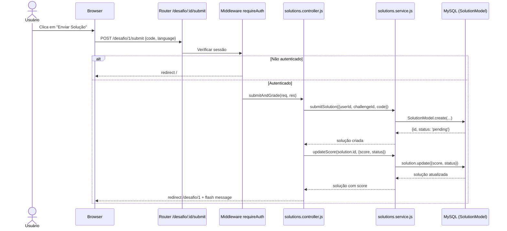

# Relatorio N3 — CodeLab

## Funcionalidade Implementada

Escolhi o módulo de submissão de soluções porque sem isso o CodeLab era só uma lista de desafios sem nenhuma interação real. O usuário precisa conseguir mandar código e receber uma nota.

O fluxo básico é: usuário está autenticado, abre um desafio, cola o código e manda. O sistema cria a solução com status `pending`, gera um score entre 70 e 100 e define como `accepted` se for 80 ou mais, ou `rejected` se for menos. Isso tudo vai pro banco.

Regras que precisei implementar:
- não pode submeter sem estar logado
- código em branco retorna erro sem criar nada no banco
- linguagem padrão é javascript quando não informada
- updateScore precisa lançar erro se o id da solução não existir

O módulo ficou em 4 arquivos: model, service, controller e routes. Tentei manter o service sem nenhuma lógica de HTTP (isso é papel do controller) e o model sem lógica nenhuma, só a definição da tabela.

---

## Como apliquei o TDD

No começo eu escrevi o teste e rodei sem ter implementado nada, só pra ver falhar de verdade. Parece bobo mas ajuda a confirmar que o teste está testando algo de verdade.

**Exemplo — fase Red:**

```js
it('deve usar javascript como linguagem padrão quando não informada', async () => {
  SolutionModel.create.mockResolvedValue({ id: 1, status: 'pending' });

  await submitSolution({ userId: 1, challengeId: 1, code: 'x' });

  expect(SolutionModel.create).toHaveBeenCalledWith(
    expect.objectContaining({ language: 'javascript' }),
  );
});
```

Esse teste falhou porque `submitSolution` não existia. Aí implementei o mínimo:

```js
export const submitSolution = async ({ userId, challengeId, code, language = 'javascript' }) => {
  return await SolutionModel.create({ userId, challengeId, code, language, status: 'pending' });
};
```

Ficou verde. Depois disso reorganizei o controller pra separar a criação da solução da lógica de pontuação — sem os testes eu provavelmente teria deixado tudo num função só.

---

## Testes unitários

### submitSolution cria com status pending

```js
it('deve criar uma solução com status pending', async () => {
  const data = { userId: 1, challengeId: 2, code: 'return a + b;' };
  SolutionModel.create.mockResolvedValue({ id: 1, ...data, language: 'javascript', status: 'pending' });

  const result = await submitSolution(data);

  expect(SolutionModel.create).toHaveBeenCalledWith({ ...data, language: 'javascript', status: 'pending' });
  expect(result.status).toBe('pending');
});
```

O `vi.mock()` no topo do arquivo substitui o SolutionModel por uma versão fake. Assim o teste não precisa de banco nenhum e roda em milissegundos.

### updateScore lança erro quando id não existe

```js
it('deve lançar erro se solução não for encontrada', async () => {
  SolutionModel.findByPk.mockResolvedValue(null);

  await expect(updateScore(99, { score: 5 })).rejects.toThrow('Solução não encontrada');
});
```

Esse foi importante porque sem ele eu poderia ter esquecido de tratar o caso em que o findByPk retorna null — o que causaria um erro genérico muito pior em produção.

### getSolutionsByUser chama findAll com filtro certo

```js
it('deve chamar findAll com where userId correto', async () => {
  SolutionModel.findAll.mockResolvedValue([]);

  await getSolutionsByUser(42);

  expect(SolutionModel.findAll).toHaveBeenCalledWith({ where: { userId: 42 } });
});
```

Esse teste parece simples mas é exatamente o tipo de coisa que quebra quando alguém refatora e passa o id errado pro where.

---

## Testes de integração

Usei Supertest pra disparar requisições HTTP reais no app, com os services mockados. Assim testo o controller e as rotas sem precisar de banco.

### POST /desafio/ retorna 201

```js
it('deve retornar 201 ao submeter solução válida', async () => {
  submitSolution.mockResolvedValue({ id: 1, userId: 1, challengeId: 2, status: 'pending' });

  const res = await request(app)
    .post('/desafio/')
    .send({ userId: 1, challengeId: 2, code: 'return a + b;' });

  expect(res.status).toBe(201);
  expect(res.body).toHaveProperty('id', 1);
});
```

### PATCH /desafio/:id/score retorna 404 quando não acha a solução

```js
it('deve retornar 404 quando solução não for encontrada', async () => {
  updateScore.mockRejectedValue(new Error('Solução não encontrada'));

  const res = await request(app)
    .patch('/desafio/999/score')
    .send({ score: 90, status: 'accepted' });

  expect(res.status).toBe(404);
  expect(res.body).toHaveProperty('message', 'Solução não encontrada');
});
```

Esse teste garante que o controller captura a exceção do service e devolve 404, não 500.

---

## Diagrama — fluxo de submissão



---

## Testes E2E com Playwright

Os E2E abrem o Chrome de verdade e simulam o que o usuário faria. Implementei 6 testes no total.

Autenticação (3 testes):
- página de login carrega com formulário visível
- senhas diferentes no cadastro redirecionam de volta
- credenciais erradas no login redirecionam de volta

Soluções (3 testes):
- dashboard carrega com os cards de desafios
- tentar acessar /desafio/:id sem login redireciona
- tentar acessar /desafio/meus sem login redireciona

O principal problema foi que os testes E2E precisam de servidor rodando com banco real. Pra evitar depender de dados específicos no banco, escolhi testar só os fluxos que funcionam sem seed: erros de formulário e redirecionamento de rotas protegidas.

---

## Como rodar

```bash
npm install
npm run test:run        # unitários + integração
npm run test:coverage   # com cobertura
npx playwright install chromium
npm run test:e2e        # E2E
```

Arquivo `.env` necessário:
```
SESSION_SECRET=qualquer_coisa
DB_NAME=codelab_tdd
DB_USER=root
DB_PASSWORD=
DB_HOST=127.0.0.1
DB_PORT=3306
```
