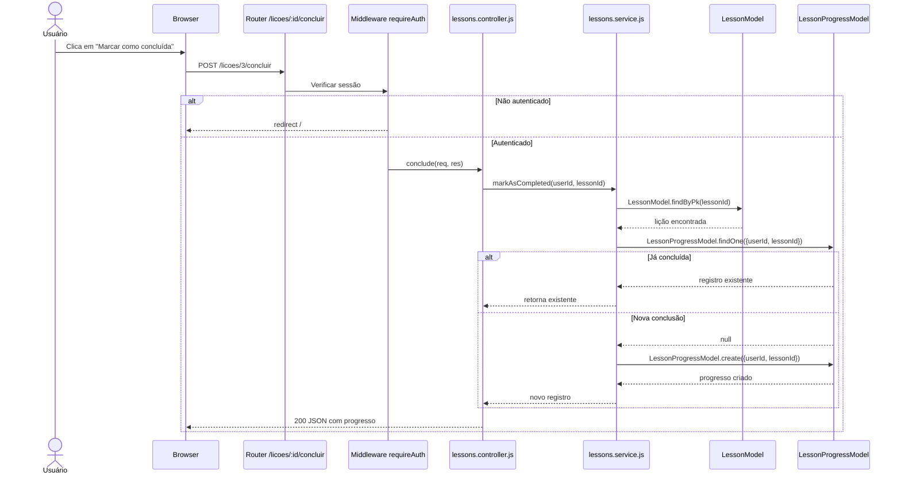
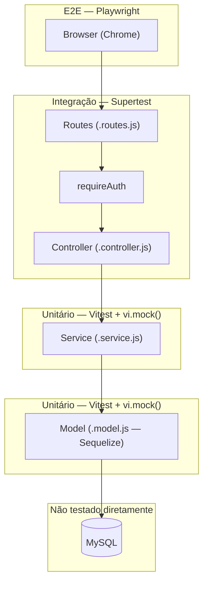

# Relatorio N3 — CodeLab SkillUp

## Funcionalidade Implementada

A funcionalidade escolhida para a N3 foi o módulo SkillUp — cadastro de lições e marcação de lições como concluídas. A ideia é que o sistema tenha lições de conteúdo (tipo "Introdução ao TDD", "Mocks com Vitest") e o usuário possa marcar cada uma como concluída para acompanhar seu progresso.

Sem isso o CodeLab era só uma lista de desafios de código, sem nenhum conteúdo educativo estruturado.

O que precisei implementar:
- cadastrar lição com título, descrição, conteúdo, categoria e nível
- nível padrão é `iniciante` quando não informado
- título não pode ser vazio — retorna erro antes de tocar no banco
- marcar lição como concluída vincula o userId ao lessonId
- não cria duplicata se o usuário já concluiu a lição
- buscar lições concluídas de um usuário específico
- rotas de marcação e listagem pessoal exigem autenticação

O módulo ficou em 4 arquivos: `lessons.model.js`, `lesson_progress.model.js`, `lessons.service.js`, `lessons.controller.js` e `lessons.routes.js`.

---

## Como apliquei o TDD

Escrevi cada teste antes da função existir. O primeiro que fiz foi o de título vazio — porque é o caso mais simples de validação e me forçou a pensar na interface da função antes de implementar qualquer coisa.

**Fase Red:**

```js
it('lança erro quando título estiver vazio', async () => {
  await expect(createLesson({ title: '' })).rejects.toThrow('Título é obrigatório');
  expect(LessonModel.create).not.toHaveBeenCalled();
});
```

Esse teste falhou porque `createLesson` não existia. Depois escrevi o mínimo pra passar:

```js
export const createLesson = async ({ title, description, content, category, level = 'iniciante' }) => {
  if (!title || !title.trim()) throw new Error('Título é obrigatório');
  return await LessonModel.create({ title, description, content, category, level });
};
```

**Refactor:** depois de todos os testes verdes, separei o modelo de progresso (`LessonProgressModel`) do modelo de lição (`LessonModel`) em arquivos distintos. Os testes existentes garantiram que a separação não quebrou nada.

---

## Testes unitários

### createLesson salva com título e categoria

```js
it('salva a lição com título e categoria', async () => {
  const data = { title: 'Introdução ao TDD', category: 'Testes', content: 'Conteúdo...' };
  LessonModel.create.mockResolvedValue({ id: 1, ...data, level: 'iniciante' });

  const result = await createLesson(data);

  expect(LessonModel.create).toHaveBeenCalledWith(expect.objectContaining({ title: 'Introdução ao TDD' }));
  expect(result.level).toBe('iniciante');
});
```

O `vi.mock('../lessons.model.js')` substitui o Sequelize por uma versão controlada. O teste não abre banco nenhum.

### markAsCompleted não cria duplicata

```js
it('retorna o registro existente sem criar duplicata', async () => {
  LessonModel.findByPk.mockResolvedValue({ id: 1 });
  const existente = { id: 5, userId: 2, lessonId: 1 };
  LessonProgressModel.findOne.mockResolvedValue(existente);

  const result = await markAsCompleted(2, 1);

  expect(LessonProgressModel.create).not.toHaveBeenCalled();
  expect(result).toBe(existente);
});
```

Esse teste foi importante porque sem ele eu poderia ter deixado o usuário criar múltiplos registros pra mesma lição.

### getLessonById lança erro quando não existe

```js
test('lança erro quando lição não existe no banco', async () => {
  LessonModel.findByPk.mockResolvedValue(null);

  await expect(getLessonById(99)).rejects.toThrow('Lição não encontrada');
});
```

Mesmo padrão do updateScore que fiz na N2 — se o findByPk retorna null, o service lança erro com mensagem clara em vez de deixar explodir mais pra frente.

---

## Testes de integração

Usei Supertest pra testar as rotas HTTP com os services mockados.

### POST /licoes cria e retorna 201

```js
it('POST /licoes cria lição e retorna 201', async () => {
  createLesson.mockResolvedValue({ id: 1, title: 'TDD Básico', level: 'iniciante' });

  const res = await request(app)
    .post('/licoes')
    .send({ title: 'TDD Básico', category: 'Testes', content: 'Conteúdo da lição' });

  expect(res.status).toBe(201);
  expect(res.body).toHaveProperty('id', 1);
});
```

### GET /licoes/minhas sem login redireciona

```js
it('GET /licoes/minhas sem login redireciona para /', async () => {
  const res = await request(app).get('/licoes/minhas');

  expect(res.status).toBe(302);
  expect(res.headers.location).toBe('/');
});
```

Esse teste confirma que o middleware `requireAuth` está na rota certa. Sem ele qualquer pessoa acessaria os dados do usuário.

---

## Diagrama de Sequência — Marcar lição como concluída



---

## Diagrama de Arquitetura — Camadas e Tipos de Teste



---

## Testes E2E com Playwright

Implementei 6 testes E2E no total, divididos em autenticação e navegação protegida.

Autenticação (3 testes):
- página de login carrega com formulário visível
- senhas diferentes no cadastro redirecionam de volta para /
- credenciais inválidas no login redirecionam para /

Navegação protegida (3 testes):
- dashboard carrega com os cards de desafios após login
- acessar rota protegida sem autenticação redireciona
- acessar `/desafio/meus` sem autenticação redireciona

O desafio nos E2E foi que eles precisam de servidor real rodando com banco. Optei por testar fluxos que não dependem de dados pré-existentes — erros de formulário e proteção de rotas — pra que os testes sejam autônomos.

---

## Lições Aprendidas (N2 e N3)

**Unitários:** O mais difícil foi entender quando mockar faz sentido. No começo parecia errado simular o banco — parecia que o teste não estaria testando nada de verdade. Mas aí percebi que o unitário testa a lógica, não a infraestrutura. O mock do `LessonProgressModel.findOne` no teste de duplicata foi o que me fez entender isso: o teste verificou que a função NÃO chama `create` quando já existe um registro, sem precisar de banco real pra provar isso.

**Integração:** Os testes com Supertest mostraram que o controller e as rotas têm comportamentos que os testes unitários não cobrem. Um exemplo claro: a proteção de rotas com `requireAuth`. Esse middleware não é testado pelos unitários do service — só aparece quando a requisição HTTP passa pelo router de verdade.

**E2E:** O Playwright abriu uma perspectiva diferente. O formulário de cadastro começa oculto no HTML e só aparece depois de clicar em uma aba. Isso não tem nenhum impacto nos testes unitários mas quebra um teste E2E se você não clicar na aba antes de preencher. São detalhes que só aparecem quando você testa como usuário.

**Mutação:** O Stryker mostrou que cobertura de linhas e mutation score são medidas diferentes. O service ficou com 88% de mutation score — os 12% que sobreviveram são relacionados à lógica de verificação de duplicata no `markAsCompleted`. Já o auth.service ficou em 100% porque cada asserção captura exatamente a mutação correspondente.

---

## Análise de Mutantes

Rodei o Stryker em `lessons.service.js`, `lessons.controller.js` e `auth.service.js`.

| Arquivo | Mutantes | Mortos | Sobreviveram | Score |
|---------|----------|--------|--------------|-------|
| auth.service.js | 23 | 23 | 0 | 100% |
| lessons.service.js | 34 | 30 | 4 | 88% |
| lessons.controller.js | 27 | 20 | 7 | 74% |

### Mutante 1 — Operador lógico no findOne (lessons.service.js)

```js
// original
const existing = await LessonProgressModel.findOne({ where: { userId, lessonId } });
if (existing) return existing;

// mutação gerada
if (!existing) return existing;  // sobreviveu
```

**Por que sobreviveu:** o teste de duplicata verifica que `create` não foi chamado, mas não verifica o que foi retornado quando o registro já existe. Mudar `if (existing)` para `if (!existing)` não seria pego por essa asserção.

**Como matar:** adicionar `expect(result).toEqual(existente)` no teste de duplicata, verificando que o retorno é o registro existente e não `undefined`.

### Mutante 2 — Condição de validação do título (lessons.service.js)

```js
// original
if (!title || !title.trim()) throw new Error('Título é obrigatório');

// mutação gerada
if (!title && !title.trim()) throw new Error('Título é obrigatório');  // sobreviveu
```

**Por que sobreviveu:** o teste passa `title: ''` (string vazia), onde `!title` já é `true`. Pra pegar essa mutação precisaria de um teste com `title: '   '` (só espaços), onde `!title` é `false` mas `!title.trim()` é `true` — só o `||` pegaria esse caso.

**Como matar:** adicionar teste com `title: '   '` esperando o erro.

---

## Como rodar

```bash
npm install
npm run test:run        # unitários + integração
npm run test:coverage   # com cobertura
npx playwright install chromium
npm run test:e2e        # E2E
npm run test:mutation   # mutation testing com Stryker
```

Arquivo `.env` necessário:
```
SESSION_SECRET=qualquer_coisa
DB_NAME=codelab_tdd
DB_USER=root
DB_PASSWORD=
DB_HOST=127.0.0.1
DB_PORT=3306
```
