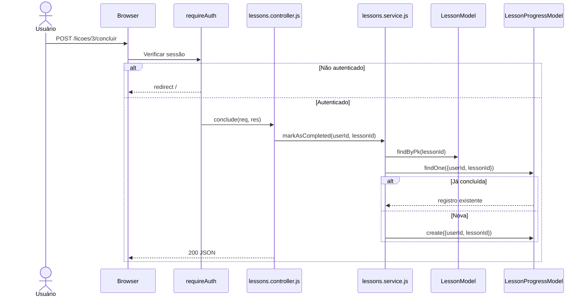
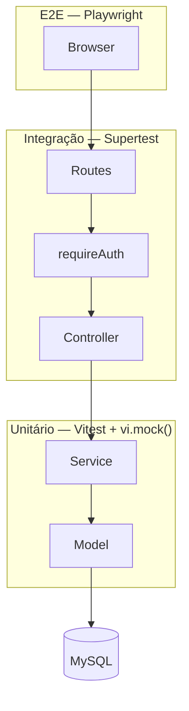

# Relatorio N3 — CodeLab SkillUp

## Funcionalidade Implementada

Módulo SkillUp — cadastro de lições e marcação como concluídas. O usuário pode ver lições de conteúdo e marcar cada uma como concluída para acompanhar seu progresso.

Regras implementadas:
- título não pode ser vazio
- nível padrão é `iniciante`
- marcar como concluída exige autenticação
- não cria duplicata se o usuário já concluiu

---

## Ciclo TDD

**Red:**
```js
it('lança erro quando título estiver vazio', async () => {
  await expect(createLesson({ title: '' })).rejects.toThrow('Título é obrigatório');
  expect(LessonModel.create).not.toHaveBeenCalled();
});
```

**Green:**
```js
export const createLesson = async ({ title, description, content, category, level = 'iniciante' }) => {
  if (!title || !title.trim()) throw new Error('Título é obrigatório');
  return await LessonModel.create({ title, description, content, category, level });
};
```

**Refactor:** separei `LessonProgressModel` de `LessonModel` em arquivos distintos. Os testes garantiram que nada quebrou.

---

## Testes Unitários

### createLesson salva com título e categoria
```js
it('salva a lição com título e categoria', async () => {
  const data = { title: 'Introdução ao TDD', category: 'Testes', content: 'Conteúdo...' };
  LessonModel.create.mockResolvedValue({ id: 1, ...data, level: 'iniciante' });

  const result = await createLesson(data);

  expect(LessonModel.create).toHaveBeenCalledWith(expect.objectContaining({ title: 'Introdução ao TDD' }));
  expect(result.level).toBe('iniciante');
});
```

### markAsCompleted não cria duplicata
```js
it('retorna o registro existente sem criar duplicata', async () => {
  LessonModel.findByPk.mockResolvedValue({ id: 1 });
  const existente = { id: 5, userId: 2, lessonId: 1 };
  LessonProgressModel.findOne.mockResolvedValue(existente);

  const result = await markAsCompleted(2, 1);

  expect(LessonProgressModel.create).not.toHaveBeenCalled();
  expect(result).toBe(existente);
});
```

### getLessonById lança erro quando não existe
```js
test('lança erro quando lição não existe no banco', async () => {
  LessonModel.findByPk.mockResolvedValue(null);
  await expect(getLessonById(99)).rejects.toThrow('Lição não encontrada');
});
```

---

## Testes de Integração

### POST /licoes retorna 201
```js
it('POST /licoes cria lição e retorna 201', async () => {
  createLesson.mockResolvedValue({ id: 1, title: 'TDD Básico', level: 'iniciante' });

  const res = await request(app)
    .post('/licoes')
    .send({ title: 'TDD Básico', category: 'Testes', content: 'Conteúdo da lição' });

  expect(res.status).toBe(201);
  expect(res.body).toHaveProperty('id', 1);
});
```

### GET /licoes/minhas sem login redireciona
```js
it('GET /licoes/minhas sem login redireciona para /', async () => {
  const res = await request(app).get('/licoes/minhas');
  expect(res.status).toBe(302);
  expect(res.headers.location).toBe('/');
});
```

---

## Diagrama de Sequência



---

## Diagrama de Arquitetura



---

## Testes E2E

6 testes com Playwright — autenticação (3) e navegação protegida (3). Testei fluxos sem dependência de dados no banco: erros de formulário e redirecionamentos de rotas protegidas.

---

## Lições Aprendidas

**Unitários:** o mock do `LessonProgressModel.findOne` no teste de duplicata foi o que me fez entender quando mockar faz sentido — o teste provou que a função não chama `create` quando o registro já existe, sem precisar de banco real.

**Integração:** o middleware `requireAuth` não é testado pelos unitários do service. Só aparece quando a requisição HTTP passa pelo router de verdade.

**E2E:** o formulário de cadastro começa oculto e só aparece depois de clicar numa aba — detalhe que só o Playwright captura.

**Mutação:** 86% de mutation score. Os sobreviventes mostraram que cobertura de linhas e qualidade dos testes são coisas diferentes.

---

## Análise de Mutantes

| Arquivo | Mutantes | Mortos | Sobreviveram | Score |
|---------|----------|--------|--------------|-------|
| auth.service.js | 23 | 23 | 0 | 100% |
| lessons.service.js | 34 | 30 | 4 | 88% |
| lessons.controller.js | 27 | 20 | 7 | 74% |

**Mutante 1 — `if (existing)` virou `if (!existing)`**
Sobreviveu porque o teste verificava que `create` não foi chamado, mas não verificava o retorno. Como matar: `expect(result).toEqual(existente)`.

**Mutante 2 — `||` virou `&&` na validação do título**
Sobreviveu porque o teste usa `title: ''` onde `!title` já é `true`. Como matar: adicionar teste com `title: '   '` (só espaços).

---

## Como rodar

```bash
npm install
npm run test:run
npm run test:coverage
npx playwright install chromium
npm run test:e2e
npm run test:mutation
```
